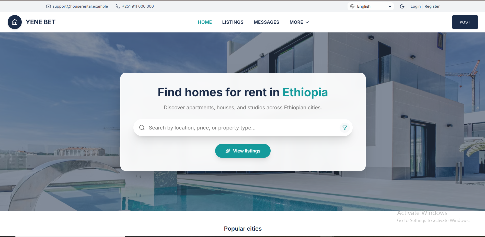
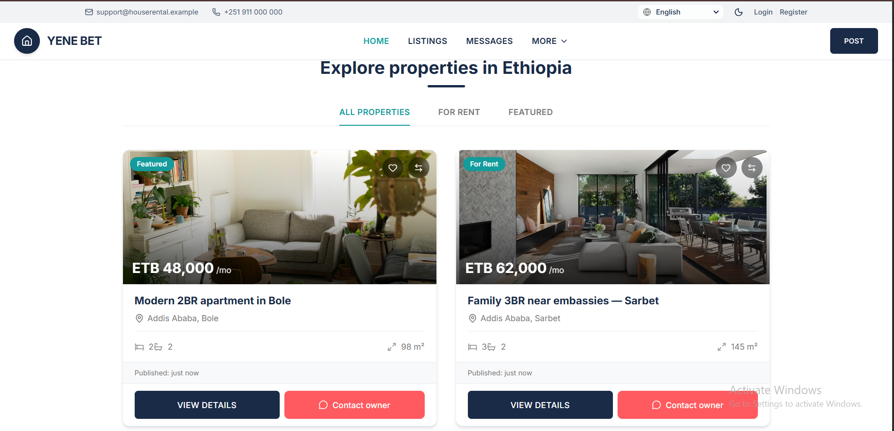
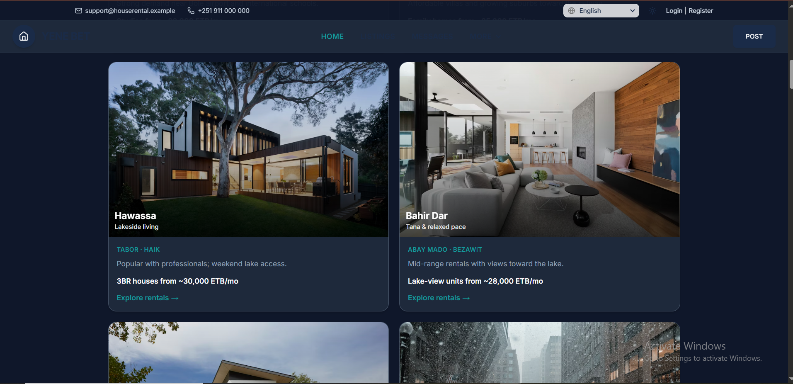
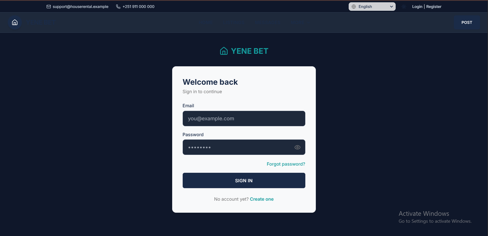
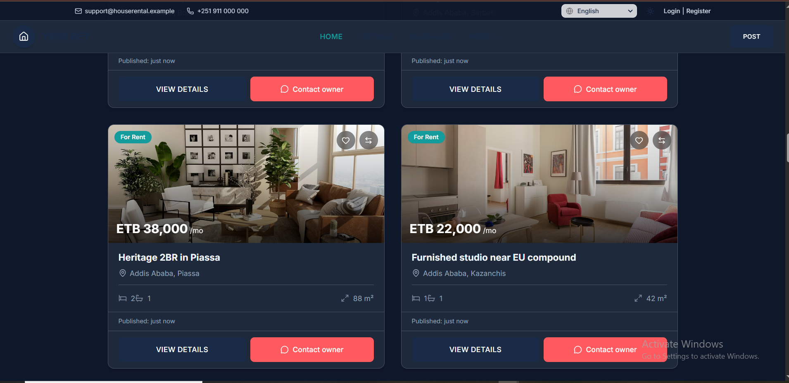

# YENE BET (RenatalWPA)

## Screenshots
### Home Page

## Feature house .

## House DarkMode

## Login Darkmode

### Feature house DarkM.


A progressive web app for browsing rental listings, saving favorites, messaging owners, and managing properties from an owner dashboard. The repo is a **monorepo**: a **Node.js + Express + MongoDB** API in `backend/` and a **Vite + React + TypeScript** SPA in `frontend/`.

## Tech stack

| Layer | Technologies |
|--------|----------------|
| Frontend | React 19, React Router, Redux Toolkit, Axios, Tailwind-style utilities, Leaflet maps, Recharts, Vitest |
| Backend | Express, Mongoose, JWT, Helmet, CORS, express-rate-limit |
| Data | MongoDB (Atlas recommended) |

## Prerequisites

- **Node.js** 18+ (LTS recommended)
- **npm**
- A **MongoDB** instance — [MongoDB Atlas](https://www.mongodb.com/cloud/atlas) free tier works well for development

## Project layout

```
RenatalWPA/
├── backend/          # REST API (port from env, default 5000 locally)
├── frontend/         # Vite dev server (port 5173 by default)
├── package.json      # Convenience scripts that delegate to frontend/backend
├── API_DOCS.md       # API reference
├── UI_FLOW.md        # UI / flow notes
└── DEPLOYMENT.md     # Separate frontend/backend deployment
```

## Quick start (local)

You need **two terminals**: one for the API and one for the Vite app.

### 1. Install dependencies

```bash
cd RenatalWPA
npm install --prefix backend
npm install --prefix frontend
```

### 2. Backend environment

```bash
cp backend/.env.example backend/.env
```

Edit `backend/.env`:

- **`MONGODB_URI`** — Atlas connection string. If the password contains `@`, URL-encode it as `%40`.
- **`JWT_SECRET`** — Use a long random string in production (see below).
- **`FRONTEND_URL`** — Must match the browser origin where the SPA runs, e.g. `http://localhost:5173`. If Vite picks another port (e.g. 5174), set this to match.

In **Atlas → Network Access**, allow your current IP (or `0.0.0.0/0` for development only).

### 3. Frontend environment (optional)

The app defaults to `http://localhost:5000/api`. Override only if your API runs elsewhere:

```bash
cp frontend/.env.example frontend/.env
# Edit VITE_API_URL if needed — must include /api, e.g. http://localhost:5000/api
```

Restart Vite after changing `frontend/.env`.

### 4. Run

**Terminal A — API**

```bash
npm run api
```

The HTTP server starts immediately. MongoDB may connect shortly after; wait until you see **`MongoDB connected`** for live data. If port `5000` is already in use, stop the other Node process or run the API on another port (see [Troubleshooting (local)](#troubleshooting-local)).

**Terminal B — frontend**

```bash
npm run dev
```

Open the URL Vite prints (often **http://localhost:5173**).

### Root `package.json` scripts

| Command | Description |
|---------|-------------|
| `npm run dev` | Start Vite dev server (`frontend`) |
| `npm start` | Same as `dev` (Vite) |
| `npm run api` | Start API with nodemon (`backend`) |
| `npm run start:api` | Start API with `node` (no watch) |
| `npm run build` | Production build of the frontend |
| `npm run preview` | Preview the production build locally |
| `npm test` | Run frontend unit tests (Vitest) |
| `npm run lint` | Lint the frontend |

## Troubleshooting (local)

- **“Port 5000 is already in use”** — Only one process can bind to a port. Stop duplicate backends (Task Manager → end extra `node.exe`, or find the PID and stop it), then run `npm run api` once. Alternatively use `npm run api:5001` from the repo root and set `VITE_API_URL=http://localhost:5001/api` in `frontend/.env`, then restart Vite.
- **Vite uses 5174 instead of 5173** — Another app is using 5173. Either free 5173 or set `FRONTEND_URL` in `backend/.env` to the origin Vite shows (e.g. `http://localhost:5174`) so CORS matches.

## Health check

With the API running:

```http
GET http://localhost:5000/api/health
```

(Use your real host/port in production.) Returns JSON including database connection state (`ok` may be false until MongoDB is connected).

## Features (high level)

- **Renters:** search listings, favorites, inquiries/messages, email verification flow (OTP surfaced in API logs when SMTP is not configured).
- **Owners:** dashboard, listings wizard, inquiries, premium hooks, analytics, profile — routes under `/owner` with a dedicated layout.
- **Auth:** register, login, JWT-protected routes, optional forgot/reset password when email env vars are set.

More detail: [API_DOCS.md](API_DOCS.md), [UI_FLOW.md](UI_FLOW.md).

Deployment (frontend and backend separately): [DEPLOYMENT.md](DEPLOYMENT.md).

## M-Pesa (premium payments)

Owner premium checkout can use **Safaricom M-Pesa STK Push** (sandbox: `apisandbox.safaricom.et`) when these are set in `backend/.env`:

- `MPESA_CONSUMER_KEY`, `MPESA_CONSUMER_SECRET` — OAuth client credentials  
- `MPESA_SHORTCODE`, `MPESA_PASSKEY` — Lipa na M-Pesa / STK  
- `MPESA_CALLBACK_URL` — **Public HTTPS** URL to `POST /api/premium/mpesa/callback` (e.g. ngrok forwarding to your local API)

Optional: `MPESA_BASE_URL`, `MPESA_PHONE_COUNTRY` (default `251`), `PREMIUM_AMOUNT`, `PREMIUM_DAYS`.

If M-Pesa variables are **missing**, `POST /api/premium/upgrade` still works as a **simulated** payment (instant premium for development).

Local testing: run the API behind a tunnel and set `MPESA_CALLBACK_URL` to `https://<tunnel-subdomain>/api/premium/mpesa/callback` so Safaricom can reach your machine.

## Production notes

- Set **`NODE_ENV=production`** on the server.
- Use a strong **`JWT_SECRET`** (at least 32 characters; the API can refuse weak or placeholder secrets in production). Generate one:

  ```bash
  node -e "console.log(require('crypto').randomBytes(32).toString('hex'))"
  ```

- Set **`FRONTEND_URL`** to your deployed SPA origin for CORS.
- Set **`VITE_API_URL`** at build time for the frontend to your public API base URL **including `/api`**.
- The API uses **`trust proxy`** in production for correct client IPs behind a reverse proxy.

### Hosting platforms (e.g. Render, Railway)

Hosts inject a **dynamic `PORT`**. The API uses:

```js
const PORT = process.env.PORT || 5000;
```

The server listens with **`httpServer.listen(PORT, ...)`** (not `app.listen`), because **Socket.IO** shares the same HTTP server. Do not hardcode `5000` in code; set `PORT` via the platform or leave the default for local dev.

## Rate limiting

Auth routes use stricter per-IP limits; all `/api/*` routes have a baseline limit. Repeated abuse may return **HTTP 429**.

## Security checklist before you push

- Never commit **`backend/.env`** (it should stay gitignored).
- Run `git status` and confirm secrets are not staged.
- Rotate any credentials that were ever committed or shared.

## Email

Optional SMTP (`EMAIL_HOST`, `EMAIL_USER`, `EMAIL_PASS`, etc.) enables password reset emails. Registration verification codes may still be printed to the **API terminal** until you wire full OTP email delivery in `authController`.

## License

Private / project-specific — follow your team’s policy.
